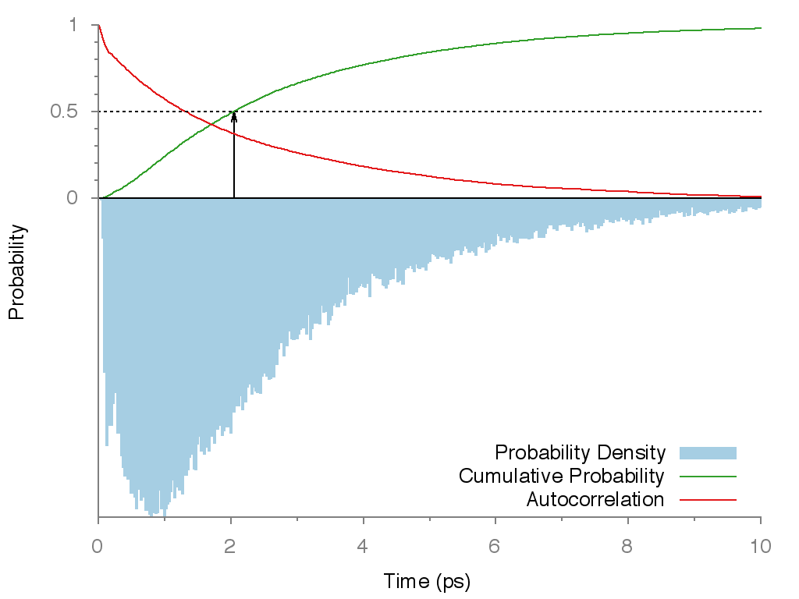
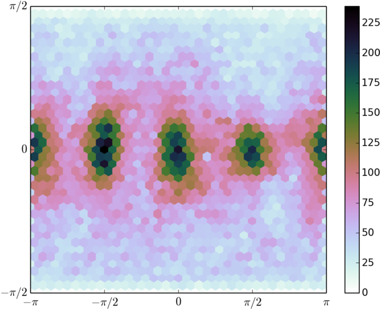
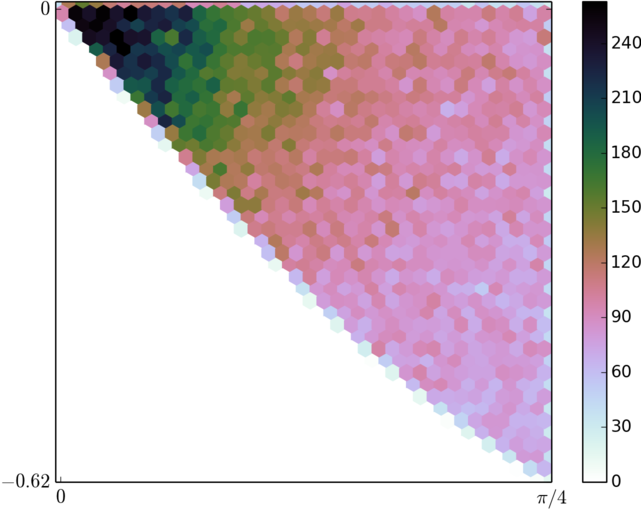

MAPI-MD-analysis
================

Codes originally written to analyse ab-initio molecular dynamics on MAPI (

Some background / very early figures, with an explanation of the simple Oh symmetry operations: http://jarvistmoorefrost.wordpress.com/2014/04/19/a-raid-on-the-inarticulate-with-shabby-equipment-always-deteriorating/

APL Materials paper with the initial analysis of a relatively short molecular dynamics data set: 

"Molecular ferroelectric contributions to anomalous hysteresis in hybrid perovskite solar cells" 
Jarvist M. Frost, Keith T. Butler and Aron Walsh
*APL Mat. 2, 081506 (2014)*; http://dx.doi.org/10.1063/1.4890246

FAPI-analysis
=============

Codes moderately adjusted to analyse FAPI (Formamidinium Lead Iodide, an analogue of MAPI with a much larger cation) molecular dynamics. This was really quite easy, as the sole C--H bond in FAPI provides a similar axis vector to the C--N bond in MAPI.

I also took the opportunity to tidy up and document the code slightly, and introduce some alternative visualisation methods.

Cubic Perovskite Structure of Black Formamidinium Lead Iodide, α-[HC(NH2)2]PbI3, at 298 K
Mark T. Weller *, Oliver J. Weber , Jarvist M. Frost , and Aron Walsh
*J. Phys. Chem. Lett., 2015, 6, pp 3209–3212*;
http://dx.doi.org/10.1021/acs.jpclett.5b01432

The figures produced look like:

